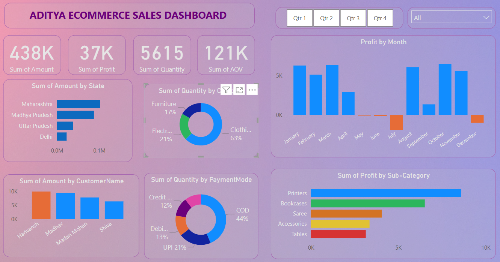

# 📊 Aditya Ecommerce Sales Dashboard  

An interactive **Power BI Dashboard** built to analyze ecommerce sales performance across different dimensions such as **State, Customer, Category, Payment Mode, and Time**.  
This project highlights data-driven decision making with a clean and modern UI.  

---

## 🚀 Features  

- **Overall KPIs**  
  - 💰 Sales Amount: **438K**  
  - 📈 Profit: **37K**  
  - 📦 Quantity: **5615**  
  - 🎯 Average Order Value (AOV): **121K**

- **Visual Insights**  
  - 🗺️ Sales by State  
  - 👥 Sales by Customer  
  - 🛒 Quantity by Category & Payment Mode  
  - 📊 Profit Trends by Month  
  - 📑 Profit by Sub-Category  

- **Filters & Slicers**  
  - Quarter-wise filter (Q1–Q4)  
  - Global filter for quick drill-down  

---

## 📷 Dashboard Preview  

  

---

## 🛠️ Tech Stack  

- **Tool:** Microsoft Power BI  
- **Data:** Sample Ecommerce Sales Dataset  
- **Visuals Used:** Bar Charts, Pie Charts, Donut Charts, KPI Cards  

---

## 📌 Key Insights  

- Maharashtra & Madhya Pradesh contribute the highest sales.  
- Clothing accounts for **63% of total quantity** sold.  
- COD is the most preferred payment method (**44%**).  
- July & December show **negative profit trends**.  
- Printers generate the maximum profit among sub-categories.  

---

## 🧑‍💻 Author  

**Aditya Singh Rana**  
- 📬 Email: adityaarana16@gmail.com  
- 🔗 LinkedIn: http://www.linkedin.com/in/aditya-rana-8b90b22ba  
- 📂 GitHub:https://github.com/adityasinghrana76  

---

⭐ If you like this project, don’t forget to **star** the repo!
